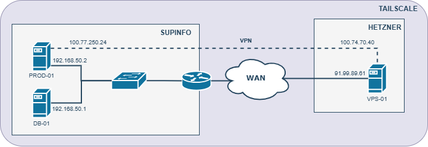

Notre infrastructure a été pensé pour être la plus sécurisé avec les moyens que nous avions à disposition.
Elle est décomposé en 2 parties:
    - Une partie "local":
    - Une partie exposé.

Pour la partie exposé, nous avions à notre disposition un VPS hébergé chez Hetzner. Nous avons installé dessus toutes les fonctionnalités qui doivent être exposé pour les utilisateurs, c'est-à-dire le site Web et la passerelle.

Côté local, nous avons 2 serveurs et 1 NAS qui nous permettent d'avoir des serveurs puissants pour héberger l'application. Nous avons installé dessus la production et la basse de données.

DB-01 (base de données) communique avec PROD-01 (serveur de production) via le réseau local.
La vrai fonctionnalité de cette infrastructure est que PROD-01 communique avec VPS-01 (passerelle) via un VPN.
Sans accès à la console d'administration de notre routeur, nous avons dû trouver une alternative. Tailsclale.
Tailscale est un outil de VPN basé sur WireGuard qui permet de créer un réseau privé chiffré entre appareils via Internet, sans configuration complexe.
Grâce à cela, nous n'avons pas eu besoin de faire de configuration en plus sur le routeur. Cette solution est pratique dans notre cas mais dans un environnement professionnel, nous aurions mis en place une autre solution.

Grâce aussi à cette infrastructure, les utilisateurs n'effectuent pas de requêtes directement sur les serveurs de production. Tout passe par la Gateway qui ensuit communique avec le serveur PROD-01.
Une couche de sécurité en plus qui n'est pas négligeable.

Ci dessous, le schéma d'infrastructure final :

